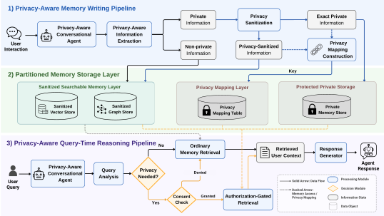

<h1 align="center">SP-Mem</h1>

<p align="center">
  <a href="https://arxiv.org/abs/2608.16551"><strong>What to Remember, What to Reveal: Privacy-Aware Memory for Conversational Agents</strong></a>
</p>

<p align="center">
  <a href="https://arxiv.org/abs/2608.16551"></a>
  <a href="https://arxiv.org/pdf/2608.16551"></a>
  <a href="https://github.com/Jensassss/SP-Mem"></a>
</p>

<p align="center">
  <a href="#sp-mem-overview">Overview</a> |
  <a href="#getting-started">Getting Started</a> |
  <a href="#running-sp-mem">Running SP-Mem</a> |
  <a href="#dataset">Dataset</a> |
  <a href="#evaluation">Evaluation</a> |
  <a href="#citation">Citation</a>
</p>

SP-Mem equips conversational agents with memory that separates searchable sanitized content from exact private values, which are restored only when needed for a task and permitted by the user.

## SP-Mem Overview

<p align="center">
  <a href="assets/spmem_overview.svg">
    
  </a>
</p>

During memory writing, SP-Mem extracts and sanitizes facts and relations, stores them in vector and graph memory, and retains mappings to separately stored private values. At query time, it retrieves relevant memories and requests consent when exact values are needed. With consent, only the required values are restored; otherwise, the agent responds using sanitized memory.

## Getting Started

Run all commands from the repository root. The core workflow requires:

- **Python** and the packages in `requirements.txt` (tested with Python 3.12);
- a running **Qdrant service** for vector memory;
- a running **Neo4j service** for graph memory; and
- OpenAI-compatible **chat and embedding endpoints** for memory construction and response generation.

The examples below use PowerShell:

```powershell
python -m venv .venv
.\.venv\Scripts\Activate.ps1
python -m pip install --upgrade pip
python -m pip install -r requirements.txt
$env:PYTHONPATH = (Resolve-Path .\src).Path
```

Set the required model, embedding, Qdrant, and Neo4j variables in the current process using [`.env.example`](.env.example) as a reference. The scripts do **not** automatically load an `.env` file.

See [docs/setup.md](docs/setup.md) for the complete service configuration, environment-variable list, storage behavior, and optional baseline dependencies.

## Running SP-Mem

The following PowerShell commands build memory and generate responses for a selected domain and inclusive user range. Replace every `<...>` placeholder before running them. Keep the domain, user range, collection, Qdrant URL, history database, and private-mapping directory consistent across the two steps.

### 1. Build memory

This command reads the selected domain's files under `data/<domain>/histories` and writes their memories:

```powershell
python scripts\build_memories.py `
  --domain <domain> `
  --start-user <start_user> --end-user <end_user> `
  --batch-size <batch_size> `
  --max-concurrent-users <max_concurrent_users> `
  --collection-name <qdrant_collection> `
  --qdrant-url <qdrant_url> `
  --history-db-path <history_db_path> `
  --privacy-mapping-dir <privacy_mapping_dir> `
  --output-log-file <write_log_file> `
  --user-done-log-file <completed_users_log_file>
```

The outputs are vector records in the selected Qdrant collection, graph records in Neo4j, local history state at `<history_db_path>`, exact private-value mappings under `<privacy_mapping_dir>`, and progress logs at the two specified log paths.

### 2. Generate responses

This command reads the selected users' evaluation queries and histories, reuses the memory written above, and generates responses for the same user range:

```powershell
python eval\run_batch_generate_responses.py `
  --domain <domain> `
  --start-user <start_user> --end-user <end_user> `
  --max-parallel <max_parallel_users> `
  --test-dir data/<domain>/evaluation_queries `
  --data-dir data/<domain>/histories `
  --response-model <response_model_key> `
  --output-tag <output_tag> `
  --collection-name <qdrant_collection> `
  --qdrant-url <qdrant_url> `
  --history-db-path <history_db_path> `
  --privacy-mapping-dir <privacy_mapping_dir> `
  --output-dir <response_output_dir>
```

Per-user JSONL responses are written under `<response_output_dir>`, with run logs under `<response_output_dir>/logs_<output_tag>`. The JSONL files are the inputs to the evaluation workflow below. Model calls may incur provider costs.

See [docs/original_workflow.md](docs/original_workflow.md) for script provenance, concurrency and retry behavior, public-path adaptations, and the relationship between these entry points and the configuration-driven utilities under `scripts/`.

## Dataset

The repository includes synthetic data for **1,000 users** across **Finance**, **Medical**, **Education**, and **Mental Support**. The data are available in [`data/`](data/), with the following components:

- **Profiles:** synthetic user preferences and private attributes used as evaluation references.
- **Histories:** conversations used to construct memory.
- **Evaluation queries:** user requests and annotations used for evaluation.

See [`data/README.md`](data/README.md) for the directory structure and field descriptions.

## Evaluation

Evaluation and aggregation utilities are provided in [`eval/`](eval/) and [`scripts/`](scripts/). See the [evaluation guide](docs/evaluation.md) for scoring generated responses, running baseline comparisons, and retrieval ablations.

## Citation

```bibtex
@article{wang2026remember,
  title         = {What to Remember, What to Reveal: Privacy-Aware Memory for Conversational Agents},
  author        = {Wang, Wenjie and Si, Wenhe and Xu, Xinyue and Xu, Yue},
  year          = {2026},
  eprint        = {2608.16551},
  archivePrefix = {arXiv},
  primaryClass  = {cs.CR},
  url           = {https://arxiv.org/abs/2608.16551}
}
```

## Acknowledgements and License

Parts of the memory implementation are adapted from [Mem0](https://github.com/mem0ai/mem0). See [THIRD_PARTY_NOTICES.md](THIRD_PARTY_NOTICES.md) and the bundled [Apache 2.0 license text](LICENSES/Apache-2.0.txt) for source and attribution details.

Repository license terms are provided in [LICENSE](LICENSE).
